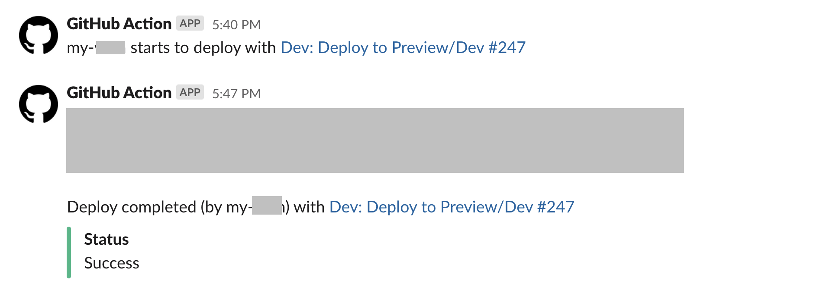

# แจ้งเตือนไปยัง Slack เมื่อ Workflow ทำงานเสร็จ

โดยจะแจ้งเตือนทั้งหมด 3 เงื่อนไข
1. เมื่อ Worflow เริ่ม
2. เมื่อ Workflow ทำงานเสร็จ ปกติ
    
3. เมื่อ Workflow ทำงานเสร็จ แต่ Error
    

**วิธีตั้งค่า**

เราต้องไปสร้าง App ใน Slack แล้วสร้าง SLACK_WEBHOOK_URL มา 

```yaml
name: "Util: Notify Slack"

on:
  workflow_run:
    workflows: 
      - "The Workflow Name That you want this actions trigger"
      
    types: [completed, requested]

jobs:
  on-requested:
    runs-on: ubuntu-latest
    if: ${{ github.event.workflow_run.status == 'queued' }}
    steps:
      - name: Send custom JSON data to Slack workflow
        uses: slackapi/slack-github-action@v1.18.0
        with:
          # For posting a rich message using Block Kit
          payload: |
            {
              "attachments": [
                {
                  "mrkdwn_in": ["pretext"],
                  "color": "#dddddd",
                  "pretext": "${{ github.actor}} starts to deploy with <${{ github.event.workflow_run.html_url }}|${{ github.event.workflow_run.name }} #${{ github.event.workflow_run.run_number }}>"
                }
              ]
            }
        env:
          SLACK_WEBHOOK_URL: ${{ secrets.SLACK_WEBHOOK_URL_TO_DEPLOYMENT_REQUEST }}
          SLACK_WEBHOOK_TYPE: INCOMING_WEBHOOK

  on-success:
    runs-on: ubuntu-latest
    if: ${{ github.event.workflow_run.status != 'skipped' && github.event.workflow_run.conclusion == 'success' }}
    steps:
      - name: Send custom JSON data to Slack workflow
        uses: slackapi/slack-github-action@v1.18.0
        with:
          # For posting a rich message using Block Kit
          payload: |
            {
              "attachments": [
                {
                  "mrkdwn_in": ["pretext"],
                  "color": "good",
                  "pretext": "Deploy completed (by ${{ github.actor}}) with <${{ github.event.workflow_run.html_url }}|${{ github.event.workflow_run.name }} #${{ github.event.workflow_run.run_number }}>",
                  "fields": [
                      {
                          "title": "Status",
                          "value": "Success",
                          "short": true
                      }
                  ]
                }
              ]
            }
        env:
          SLACK_WEBHOOK_URL: ${{ secrets.SLACK_WEBHOOK_URL_TO_DEPLOYMENT_REQUEST }}
          SLACK_WEBHOOK_TYPE: INCOMING_WEBHOOK
          
  on-failure:
    runs-on: ubuntu-latest
    if: ${{ github.event.workflow_run.status != 'skipped' && github.event.workflow_run.conclusion == 'failure' }}
    steps:
      - name: Send custom JSON data to Slack workflow
        uses: slackapi/slack-github-action@v1.18.0
        with:
          # For posting a rich message using Block Kit
          payload: |
            {
              "attachments": [
                {
                  "mrkdwn_in": ["pretext","footer"],
                  "color": "danger",
                  "pretext": "Deploy Error (by ${{ github.actor}}) with <${{ github.event.workflow_run.html_url }}|${{ github.event.workflow_run.name }} #${{ github.event.workflow_run.run_number }}>",
                  "fields": [
                      {
                          "title": "Status",
                          "value": "Error",
                          "short": true
                      }
                  ]
                }
              ]
            }
        env:
          SLACK_WEBHOOK_URL: ${{ secrets.SLACK_WEBHOOK_URL_TO_DEPLOYMENT_REQUEST }}
          SLACK_WEBHOOK_TYPE: INCOMING_WEBHOOK
```